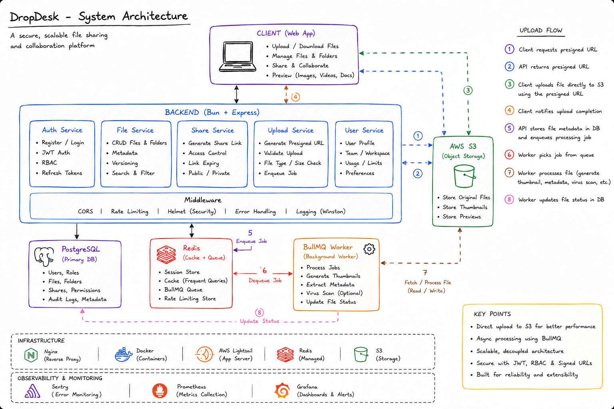

# Dropdesk

A high-performance, collaborative media sharing workspace designed for teams. Dropdesk provides a robust platform for teams to create isolated workspaces, manage users, and share media files efficiently, built on a decoupled, scalable backend architecture.

## Links

- **Live Demo**: [Add link here]
- **Video Walkthrough**: https://www.youtube.com/@0bhishekk

## Why Dropdesk?

While platforms like Google Drive or Dropbox are excellent general-purpose tools, Dropdesk is built specifically to address engineering challenges around high-throughput media sharing within team-centric isolated environments. It serves as a comprehensive demonstration of handling complex backend workflows—such as asynchronous media processing, secure direct-to-cloud uploads, and decoupled task execution—while maintaining a highly responsive REST API.

## Architecture & Data Flow

Dropdesk is designed around a micro-architecture pattern that separates the main API thread from computationally heavy tasks.




1. **Authentication & Authorization**: The user authenticates via the Express API (using JWTs). Access to workspaces and media is strictly controlled through role-based access control (RBAC) enforced at the database level.
2. **Media Upload Flow (Direct-to-S3)**: 
   - Instead of uploading files directly to the Node/Bun server, the client requests a secure presigned URL from the API.
   - The client uploads the file directly to AWS S3 using this URL. This saves server bandwidth and drastically improves upload speeds.
3. **Background Processing**:
   - Once the upload completes, the client notifies the API. 
   - The API pushes a job to a Redis queue.
   - A background worker (powered by BullMQ) picks up the job and processes the media (e.g., generating thumbnails using `sharp`, running garbage collection, sending email notifications).

## Technical Decisions & Tradeoffs

- **Direct S3 Uploads via Presigned URLs**: 
  - *Decision*: Offload file transfers from the primary server.
  - *Tradeoff*: Increases client-side complexity and requires strict CORS/IAM policies on AWS, but prevents the main API thread from blocking during large file transfers.
- **Background Workers (BullMQ + Redis)**: 
  - *Decision*: Decouple heavy workloads (media compression, emails) from the main request-response lifecycle.
  - *Tradeoff*: Introduces infrastructure overhead (requires Redis), but ensures the API remains fast and highly available under load.
- **Bun Runtime**: 
  - *Decision*: Use Bun instead of Node.js for faster startup times, native TypeScript support, and improved performance.
  - *Tradeoff*: A newer runtime with a slightly smaller ecosystem, but the performance benefits for a backend service are significant.
- **Prisma ORM with PostgreSQL**: 
  - *Decision*: Ensure strict type safety from the database to the API layer.
  - *Tradeoff*: Slightly heavier abstraction compared to raw SQL, but significantly improves developer velocity and reduces runtime errors.

## Tech Stack

- **Runtime & Language**: Bun, TypeScript
- **Framework**: Express.js
- **Database & ORM**: PostgreSQL, Prisma
- **Caching & Queues**: Redis, BullMQ
- **Cloud Storage**: AWS S3 (AWS SDK) & S3 Lifecycle Policies
- **Media Processing**: Sharp
- **Security, Validation & Logging**: Zod, JWT, Cookie-Session, Helmet, CORS, Winston
- **Infrastructure & Deployment**: Docker, Nginx (Reverse Proxy), AWS EC2, GitHub Actions (CI/CD), CloudWatch

## Local Development Setup

### Prerequisites
- Bun installed on your system
- Docker and Docker Compose
- AWS S3 bucket credentials

### Installation

1. **Clone the repository**
   ```bash
   git clone https://github.com/iCoderabhishek/Dropdesk.git
   cd Dropdesk
   bun install
   ```

2. **Environment Configuration**
   Create a `.env` file in the root directory. Check `src/config/env.ts` for the required keys (Database URL, Redis URL, AWS credentials, JWT secrets).

3. **Start Infrastructure Services**
   Start the PostgreSQL and Redis containers in the background:
   ```bash
   bun run docker-dev
   ```

4. **Database Migrations**
   Initialize the database schema and generate the Prisma client:
   ```bash
   bun run migrate
   bun run generate
   ```

5. **Start the Development Server**
   ```bash
   bun run dev
   ```
   The API will be accessible on your local port.

## Project Structure

- `src/api/`: Express application, routes, middlewares, and controllers.
- `src/config/`: Environment validation and global configurations.
- `src/workers/`: Background job processors handling Redis queues.
- `prisma/`: Database schemas and migration files.

## License

This project is licensed under the ISC License.
